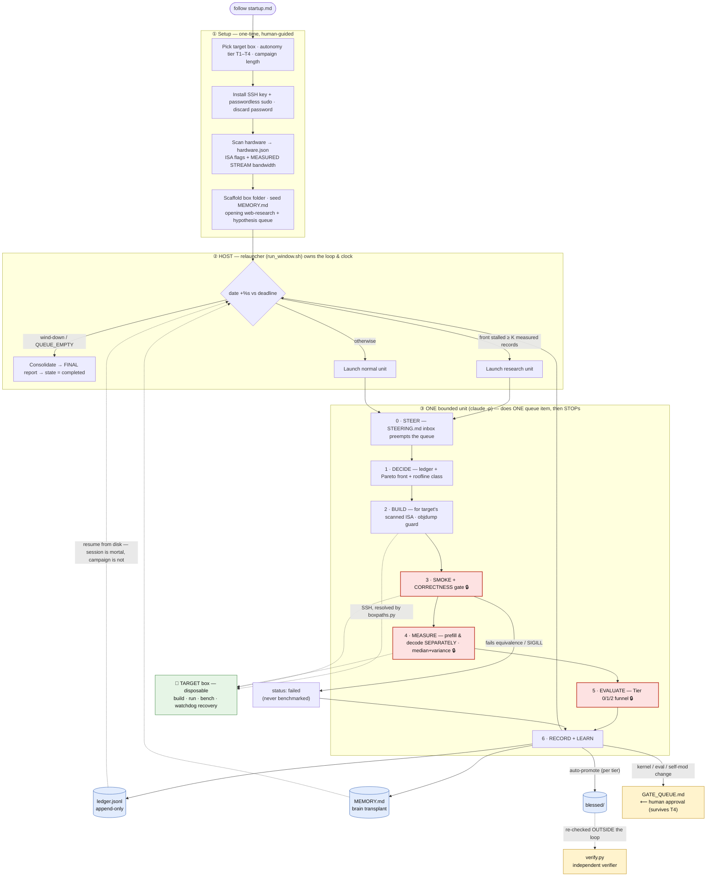
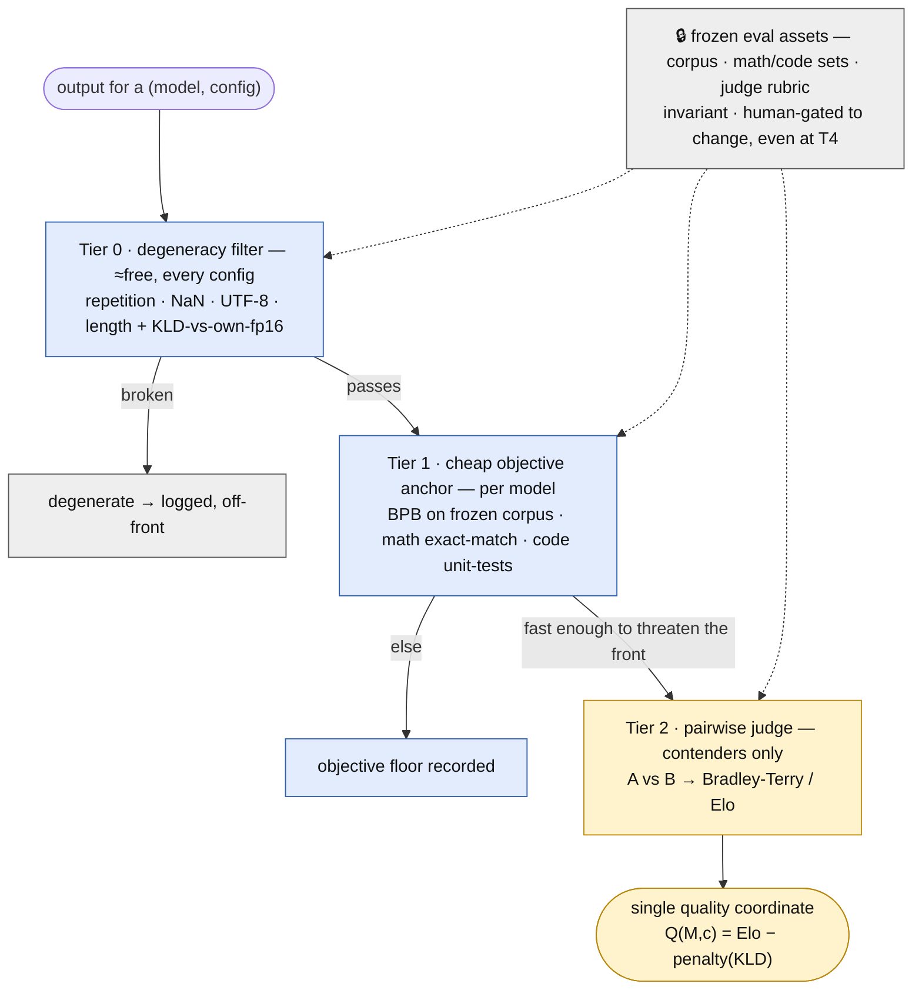

# How Crucible works

Crucible turns one salvage box into a self-driving inference-optimization lab. The
controlling idea is **open hypothesis space, protected evaluation**: the search may rewrite
almost anything (engines, kernels, quant, models, even its own orchestration at T4), but a
small **invariant kernel** — correctness gating, measurement hygiene, the clock, the ledger,
recovery, and the frozen eval assets — is protected so the optimizer can't Goodhart its own ruler.

## 1 · Campaign control flow

The loop lives **outside** any model session: the external relauncher owns the clock and
launches one bounded unit at a time, so a dead or derailed session can never run the campaign
off the rails. Each unit does exactly one queue item and stops. 🔒 marks invariant-kernel steps.

## 2 · The roofline router + the recursion ladder

The roofline is the brain: it classifies every result as memory-bound or kernel-bound and
routes the next proposal there. Escalation up the L0→L3 ladder is triggered by **evidence**
(front stall or roofline class), not whim — and a winning kernel/family becomes the new
baseline, so the inner search restarts on top of it.

```mermaid
flowchart LR
    classDef mb fill:#e2ecfd,stroke:#2c5db0,color:#111
    classDef kb fill:#fde2e2,stroke:#c0392b,color:#111

    R{"Roofline<br/>efficiency = achieved decode ÷ bandwidth ceiling"}
    R -->|"≥ 0.6 · near the memory wall"| MB
    R -->|"< 0.6 · perf left on the floor"| KB

    subgraph MB["MEMORY-BOUND — reduce bytes / token"]
        direction TB
        M1["small-active MoE"]
        M2["lower-bit quant (KLD-guarded)"]
        M3["speculative decoding"]
        M4["KV-cache quant"]
    end
    subgraph KB["KERNEL-BOUND — better code"]
        direction TB
        K1["thread-count knee"]
        K2["integer-SIMD kernels + prefetch"]
        K3["compile flags + PGO"]
        K4["engine fork / R4 repack"]
    end

    MB --> ESC
    KB --> ESC
    ESC{"front gaining ground?"}
    ESC -->|"yes"| L1["L0–L1 · config-space sampler<br/>NSGA-II / TPE — automatic, cheap"]
    ESC -->|"no · escalate"| L2["L2 · write / modify kernels"]
    L2 --> L3["L3 · switch model / quant / arch family"]
    L1 -.->|"re-measure"| R
    L2 -.->|"new baseline engine"| R
    L3 -.->|"re-baseline everything"| R
    class MB,M1,M2,M3,M4 mb
    class KB,K1,K2,K3,K4 kb
```

## 3 · The evaluation funnel (why a self-modifying agent can't cheat)

Cheap **objective** filters gate entry to the expensive **subjective** judge, so the judge can
never single-handedly elevate something the objective signals call garbage. Everything that *is
the ruler* — the frozen corpus, item sets, and judge rubric — is invariant-kernel and can only
be changed through the human gate.

## The four recorded axes (no scalar collapse)

Results land on a **Pareto front**, not a weighted sum — the optimizer chases hypervolume so
the human picks the operating point later:

1. **Decode throughput** (batch-1 tok/s) — the memory-bandwidth-bound axis
2. **Prefill throughput + TTFT** — the compute/SIMD-bound axis, kept separate on purpose
3. **Quality** — one cross-model coordinate (Elo-anchored, KLD-interpolated)
4. **Perf/watt** — recorded, never gating

Peak RSS and roofline efficiency ride along as context.
