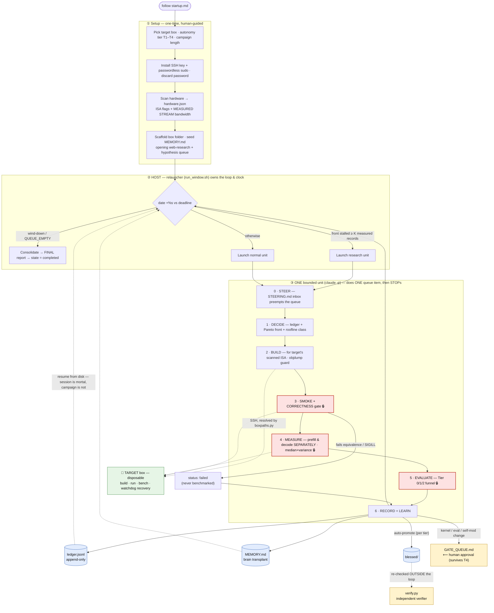
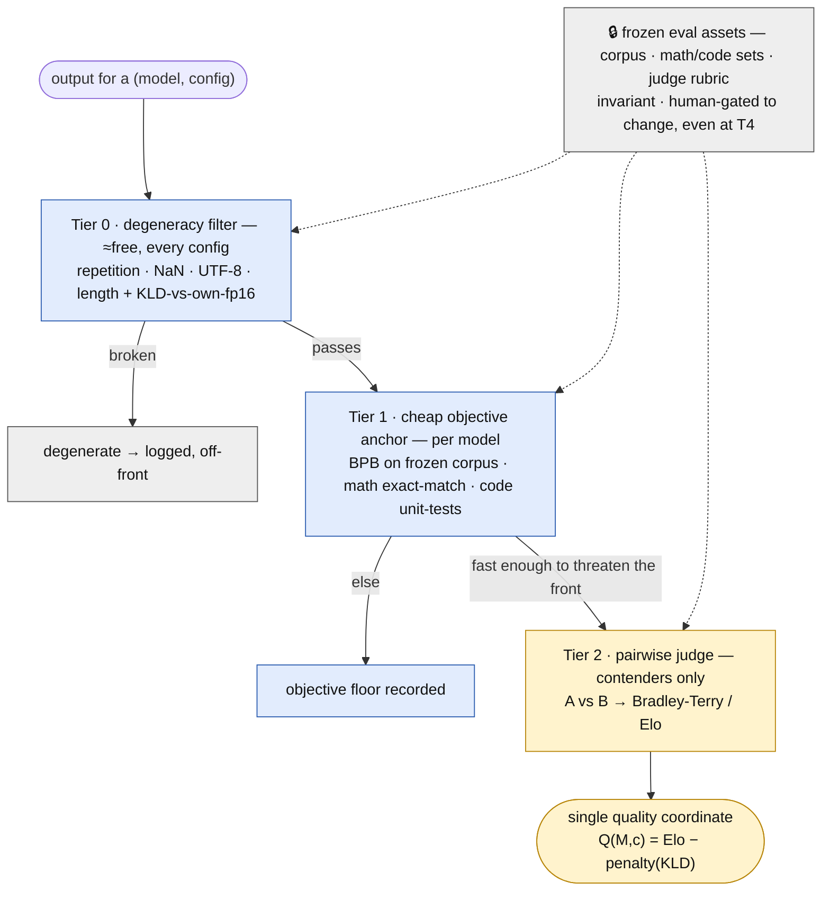

# crucible

A recursive, self-improving research harness that drives a single throwaway target
box over SSH to discover **maximally fast and intelligent batch-1 LLM inference** on
**AVX-less, memory-bandwidth-limited salvage hardware**.

One Claude Code session (Opus 4.8) on a host machine is the orchestrator, the
proposer, and the judge. It SSHes into one target box, scans it, and then runs an
open-ended search over engines, models, quantizations, kernels, compile flags, and
algorithms — extending its own search code as it goes — to push a Pareto frontier of
speed vs. quality. The mission is to advance local AI for people whose only hardware
is salvage.

## The one idea that organizes everything

**Open hypothesis space, protected evaluation.**

- *Everything worth trying is discovered, never hardcoded.* Which engine, which fork,
  which model, which architecture (dense / MoE / SSM / whatever the agent finds),
  which kernel, which quant, which compile flags, the search algorithm itself, and —
  at the top autonomy tier — the orchestration code. The action space is genuinely
  open; the agent populates it by web research, testing, and random hypotheses.
- *A tiny kernel of method is protected from the search.* Five invariants
  (correctness gating, measurement hygiene, time discipline, resumability, target
  recovery) and the frozen evaluation assets. These are **not optimization avenues**.
  They exist because any optimizer that can rewrite both its engine and its own
  evaluation will, with certainty, find ways to make the number go up that aren't
  real progress. The kernel protects the thing you actually want — real progress —
  from being Goodharted by the search.

Freedom in *what to try*; discipline in *how it's judged*.

## The physics anchor

Batch-1 **decode** is memory-bandwidth-bound: `tok/s ≈ effective_BW / active_bytes_per_token`.
**Prefill** is compute/SIMD-bound. AVX-lessness mostly costs prefill and the
dequant+dot-product hot path; it barely moves the decode ceiling because that ceiling
is the DRAM bus. The two phases are optimized separately, always. This single fact
dictates what is even worth searching — see `doctrine/03_PROPOSER_PLAYBOOK.md`.

## How it works

Crucible turns one salvage box into a self-driving inference-optimization lab. The
controlling idea is **open hypothesis space, protected evaluation**: the search may rewrite
almost anything (engines, kernels, quant, models, even its own orchestration at T4), but a
small **invariant kernel** — correctness gating, measurement hygiene, the clock, the ledger,
recovery, and the frozen eval assets — is protected so the optimizer can't Goodhart its own ruler.

### 1 · Campaign control flow

The loop lives **outside** any model session: the external relauncher owns the clock and
launches one bounded unit at a time, so a dead or derailed session can never run the campaign
off the rails. Each unit does exactly one queue item and stops. 🔒 marks invariant-kernel steps.



### 2 · The roofline router + the recursion ladder

The roofline is the brain: it classifies every result as memory-bound or kernel-bound and
routes the next proposal there. Escalation up the L0→L3 ladder is triggered by **evidence**
(front stall or roofline class), not whim — and a winning kernel/family becomes the new
baseline, so the inner search restarts on top of it.

```mermaid
flowchart LR
    classDef mb fill:#e2ecfd,stroke:#2c5db0,color:#111
    classDef kb fill:#fde2e2,stroke:#c0392b,color:#111

    R{"Roofline<br/>efficiency = achieved decode ÷ bandwidth ceiling"}
    R -->|"≥ 0.6 · near the memory wall"| MB
    R -->|"< 0.6 · perf left on the floor"| KB

    subgraph MB["MEMORY-BOUND — reduce bytes / token"]
        direction TB
        M1["small-active MoE"]
        M2["lower-bit quant (KLD-guarded)"]
        M3["speculative decoding"]
        M4["KV-cache quant"]
    end
    subgraph KB["KERNEL-BOUND — better code"]
        direction TB
        K1["thread-count knee"]
        K2["integer-SIMD kernels + prefetch"]
        K3["compile flags + PGO"]
        K4["engine fork / R4 repack"]
    end

    MB --> ESC
    KB --> ESC
    ESC{"front gaining ground?"}
    ESC -->|"yes"| L1["L0–L1 · config-space sampler<br/>NSGA-II / TPE — automatic, cheap"]
    ESC -->|"no · escalate"| L2["L2 · write / modify kernels"]
    L2 --> L3["L3 · switch model / quant / arch family"]
    L1 -.->|"re-measure"| R
    L2 -.->|"new baseline engine"| R
    L3 -.->|"re-baseline everything"| R
    class MB,M1,M2,M3,M4 mb
    class KB,K1,K2,K3,K4 kb
```



### 3 · The evaluation funnel (why a self-modifying agent can't cheat)

Cheap **objective** filters gate entry to the expensive **subjective** judge, so the judge can
never single-handedly elevate something the objective signals call garbage. Everything that *is
the ruler* — the frozen corpus, item sets, and judge rubric — is invariant-kernel and can only
be changed through the human gate.



### The four recorded axes (no scalar collapse)

Results land on a **Pareto front**, not a weighted sum — the optimizer chases hypervolume so
the human picks the operating point later:

1. **Decode throughput** (batch-1 tok/s) — the memory-bandwidth-bound axis
2. **Prefill throughput + TTFT** — the compute/SIMD-bound axis, kept separate on purpose
3. **Quality** — one cross-model coordinate (Elo-anchored, KLD-interpolated)
4. **Perf/watt** — recorded, never gating

Peak RSS and roofline efficiency ride along as context.

## Requirements

- **Host** (where the Claude Code session runs — never the target): `python3` (≥3.10, stdlib
  only — no `pip install`; the dashboard *server* is pure stdlib and the client's front-end libs
  are **vendored**, so nothing is fetched at runtime), `git`, `ssh`/`ssh-keygen`, and `sshpass`
  (installed once to seed the key). The host drives everything and serves the dashboard.
- **Target** (the disposable salvage box): reachable over SSH with a sudo-capable user. Nothing
  is pre-installed — the agent builds the engine on the target itself. The box may be asleep;
  if `hardware.json` records Wake-on-LAN, the resolver can wake it.
- **Models**: fetched over the internet as needed, or staged on a LAN store (the wizard asks
  whether models are staged on a LAN path) to avoid re-downloading.

## Start fresh — drop in, answer the wizard

1. **Get the files into one folder.** Download the [latest release](https://github.com/parkat/Crucible/releases)
   zip and unzip it, or `git clone https://github.com/parkat/Crucible.git`. Files may be flat,
   mis-nested, or already structured — it does not matter; the boot step repairs the layout.
   *(If you cloned, first `cp startup.template.md startup.md` — the release zip already includes it.)*
2. **Open a Claude Code session in that folder** and tell it:

   > follow startup.md

3. **Answer the pickers.** The session runs a setup **wizard** — it asks you for the target box
   (IP, SSH user/pass, a nickname; optional LAN model store), an **autonomy tier**, and a
   **campaign length**. Nothing to pre-edit; the SSH password is used once to install a key, then
   discarded (never written to disk).

That one instruction then runs end to end: **repairs the layout** (`preflight.py` rebuilds the
canonical tree from the flat dump) → **installs a dedicated SSH key and discards the password** →
**scans the hardware into a COMPLETE contract** (ISA, measured bandwidth, GPU `sm_NN`/VRAM,
Wake-on-LAN) → **writes `connection.json`** → **scaffolds the box folder** (its own git repo, with
a `STEERING.md` inbox) → **starts the dashboard** → **seeds `MEMORY.md`** with research + a takeable
hypothesis queue → **launches the loop**. One instruction, answer a few questions, done.

## Run / resume the campaign

The research loop runs **outside** the session, in an external relauncher — so a dead or
derailed session can never run the campaign off the rails. The loop lives on disk:

```bash
./scaffold/run_window.sh boxes/<nick>          # continue the current window as-is
./scaffold/run_window.sh boxes/<nick> 24       # RE-ARM a fresh 24-hour window, then run
./scaffold/run_window.sh boxes/<nick> --dry-run # preview the epoch math + the exact invocation
```

`hours` re-arms a fresh window (new start/deadline, same wind-down margin); omit it to
continue the current one. Everything is read from the three contracts — nothing depends on
prose or on a session's memory. **The session is ephemeral; the campaign lives on disk.**

## Add a second box (fleet parallelism)

Each box is driven by its own independent relauncher — run as many as you have hardware for:

```bash
# 1. in a fresh session: "follow startup.md" and answer the wizard for the new nickname
# 2. drive it (in its own terminal):
./scaffold/run_window.sh boxes/<newnick> 24
```

Results compare across boxes via **roofline efficiency** (achieved ÷ ceiling), so a fast box
and a slow box are judged on the same scale.

## The contract trio + the resolver

Nothing hardcodes how to reach or build on a box. Each box folder carries three contracts,
and `scaffold/boxpaths.py` turns them into concrete commands:

| contract | answers | lives at |
|---|---|---|
| `connection.json` | **how to reach** the box (host, user, key, remote paths) | `boxes/<nick>/` |
| `hardware.json`   | **what the box is** (ISA, bandwidth, GPU, Wake-on-LAN) | `boxes/<nick>/` |
| `campaign.json`   | **the current window** (start/deadline, thresholds, state) | `boxes/<nick>/` |

```bash
python3 scaffold/boxpaths.py boxes/<nick> --ssh        # the SSH prefix (append a remote command)
python3 scaffold/boxpaths.py boxes/<nick> --build      # remote build bin dir (build-cuda<NN> if GPU)
python3 scaffold/boxpaths.py boxes/<nick> --build --cpu # force the CPU build dir
python3 scaffold/boxpaths.py boxes/<nick> --lock-path  # the target-side box lock
python3 scaffold/boxpaths.py boxes/<nick> --wake       # wake a sleeping box (WoL / PowerShell helper)
```

Every loop prompt resolves the box through this tool, so the whole apparatus is
host/target/hardware-agnostic: point it at a different box folder and every command
re-resolves. (The password is **never** stored — it is used once at setup, then discarded.)

## Loop behavior

The relauncher launches one **bounded unit** at a time (`claude -p` with the box injected).
Each unit does exactly ONE takeable queue item, gates it (KLD &lt; 0.02 for kernels; Tier-0 +
chat template for instruct models), records to the ledger, leaves the queue's top takeable,
and **stops**. The relauncher then decides whether to launch the next:

```
bounded units ──▶ wind-down (deadline − margin) ──▶ consolidate once ──▶ exit
        └────────▶ queue empty (work/QUEUE_EMPTY sentinel) ──▶ consolidate ──▶ stop
```

**Research is automatic, not a separate session.** The opening web-research phase seeds the
queue at startup; thereafter `doctrine/03`'s "research whenever the front stalls" is enforced by
the relauncher: when the Pareto front hasn't gained ground in `front_stall_K` **measured**
records, the next unit is spent on a web-research phase (refresh the landscape, push 1–3 fresh
takeable hypotheses to the queue) instead of grinding the stale queue — never two research units
in a row, so a normal unit acts on the new hypotheses before the next research pass. You don't
run a separate session to refill the queue; units both execute and refill it.

`winddown_epoch = deadline − (deadline − start) × winddown_margin_frac`. **Wind-down ≠ stop:**
units keep running until wind-down; only then does the session switch to consolidation-only
(make `MEMORY.md` current, leave the queue clean + tagged + takeable-top, write the FINAL
report). To resume later, just run `run_window.sh` again — it reconstructs state from disk
(`MEMORY.md` + `ledger.jsonl` + the clock).

## Steering a live campaign (from your phone)

Read something in AI-research news and want the campaign to chase a front **you** found? Drop a
note in the box's **`STEERING.md`** inbox — the worker reads it at the **start of every unit**
and treats each Inbox note as a top-priority hypothesis: it folds the note into the queue
(splitting to a takeable item if large), pursues it ahead of the stale queue top, then **moves
the note out of the Inbox the same unit** — to **Picked up** (with what it queued/measured) or
**Dropped** (with a reason if it isn't viable). The Inbox only ever holds notes not yet acted
on, so stale steering can never re-poison a later research round.

Add a note with the helper (well-formed, safe to run from anywhere):

```bash
python3 scaffold/steer.py boxes/<nick> "look into Mamba-2 SSD CPU-decode kernels" --tag HOST --research
python3 scaffold/steer.py boxes/<nick> "try IQ2_XXS on the 70B" --tag BOX
python3 scaffold/steer.py boxes/<nick> --list      # what's still pending
```

`--tag BOX|HOST|EITHER` hints the resource; `--research` asks for a web-research phase rather
than a bench; `--note "…"` adds context. You can also hand-edit `STEERING.md` directly — the
helper just keeps the format clean. The worker commits `STEERING.md` with each unit, so picked-up
and dropped notes are a permanent audit trail in the box's repo.

**The phone workflow:** keep a Claude Code session open on the crucible host and reach it with
remote control from your phone. Tell it "steer `<nick>` toward X" and it runs `steer.py` (or edits
`STEERING.md`); then watch the dashboard's **Operator steering** panel flip your note from
*pending* to *picked up / dropped* once the next unit consumes it — confirmation, from your
pocket, that the campaign heard you. Adding a note never interrupts a unit mid-flight; it lands
at the next Orient.

## Watch it live — the dashboard

An auto-refreshing **System-3 desktop** runs on the **host** (it never polls the target — that
would perturb the very numbers the campaign measures). It renders entirely from host-side
artifacts and tolerates files being appended to mid-read. Beyond monitoring it can **steer**: a
localhost-only write-API shells to the same vetted CLIs you'd run by hand (`steer.py`, `window.py`,
`queue.py`, the hardware probe) — inject a steering note, arm/extend/stop the time window, take a
queue item, or re-probe hardware, all from the desktop.

```bash
python3 scaffold/dashboard/server.py boxes/<nick>     # one box
python3 scaffold/dashboard/server.py boxes            # the whole fleet (one panel per box)
# then open the printed http://127.0.0.1:8787/   (override with --port / --host)
```

The client is a ground-up System-3 build (vendored `system.css` + `interact.js`, real Chicago/Geneva/
Monaco faces): draggable/resizable windows, an Apple-menu launcher, a Control Panel (themes — 1-bit /
Night / Amber / Green — a draw-your-own desktop-pattern editor, and a UI-scale/Text-Size control), a
Reports floppy that opens FINAL reports as rendered documents, a Read Me, and a boot sequence + chime.
Every chart (Pareto scatter, gauges, sparklines, bars) is drawn 1-bit through one shared `Draw` module.

Per box it shows, all from `boxes/<nick>/`:

- **Window status** — phase (`running` / `winddown` / `done`) with live countdowns to both
  wind-down and the deadline, from `campaign.json`.
- **Live agent activity** — the current task (the takeable-top item, or "web-research phase"
  when stalled) with the time it **started** and a running elapsed; units completed this window,
  cumulative `total_cost_usd`, and the `QUEUE_EMPTY` sentinel — from the `run_window` driver log
  and each unit's `claude -p` output.
- **Live transcript** — the running unit's thinking + every tool/SSH command + results,
  streamed as it happens. `run_window.sh` runs units with `--output-format stream-json`, so
  each unit's `.jsonl` grows live and the dashboard tails it (host-side; the box is never
  polled). The panel auto-follows the newest event unless you scroll up.
- **Research progress** — the Pareto front, every measured model, the roofline gauge, the
  iteration timeline, and key findings (each stamped with when it was logged), from `ledger.jsonl`.
- **Latest research round** — the results summary + fresh hypotheses from the most recent
  stall-triggered web-research unit, with when it ran.
- **Queue** — the `[BOX]`/`[HOST]`/`[EITHER]`-tagged hypothesis queue from `MEMORY.md`, with
  the takeable-top item highlighted and closed items listed.
- **Operator steering** — your `STEERING.md` inbox: notes you injected that are still *pending*,
  plus the recently *picked up* / *dropped* ones — so a glance from your phone confirms a steer
  landed and what became of it.
- **Hardware contract** — measured STREAM bandwidth (the roofline denominator), ISA, GPU, RAM.
- **Window concluded** — once a run ends, the sealed `MEMORY.md` is rendered in full as the
  document the window leaves behind (appears only when the campaign has wound down).
- **Hype board** — the agent's own findings, bragged about, synthesized live from the ledger.
  Purely for morale.

The fleet bar at the top shows one card per box (phase, countdowns, units, cost); click a card
to focus its detail panels.

## Layout

```
crucible/
  README.md              <- you are here
  LICENSE                <- MIT
  startup.template.md    <- entry point: the setup wizard (copy to startup.md, or use the release's)
  doctrine/              <- the agent's constitution (read in full before acting)
    00_PRIME_DIRECTIVE.md    mission, physics, the invariant kernel
    01_RUBRIC.md             the Pareto axes + how quality is scored
    02_EVAL_FUNNEL.md        how "any model" is evaluated cheaply and un-gameably
    03_PROPOSER_PLAYBOOK.md  roofline router, action space, recursion levels
    04_AUTONOMY_TIERS.md     T1-T4 and what each unlocks
    05_SAFETY_RECOVERY.md    ISA guard, watchdog, the independent verifier
    06_OPERATIONS.md         the iteration loop, time discipline, resume protocol
  templates/             <- instantiated once per box
  scaffold/              <- runnable spine (ledger, scan, roofline, verifier, eval, dashboard)
    preflight.py           rebuilds the canonical tree from a flat/mis-nested dump
    boxpaths.py            the box resolver: contracts -> concrete ssh/build/lock/wake commands
    run_window.sh          the external relauncher: owns the bounded-unit research loop
    steer.py               drop an operator steering note into a box's STEERING.md inbox
    hardware_scan.sh       scans a box into a COMPLETE contract (ISA, BW, GPU, Wake-on-LAN)
    prompts/               unit.md + consolidate.md (box-agnostic; injected per run)
    dashboard/             host-side System-3 desktop: server.py (data + localhost write-API) +
                           index.html (client); vendored system.css/interact.js under vendor/, fonts/
    ledger.py roofline.py correctness.py verify.py eval/   <- scoring + the frozen eval funnel
  boxes/<nickname>/      <- created per target box; the live campaign state (its own git repo)
    connection.json        how to reach it   | hardware.json  what it is
    campaign.json          the current window | MEMORY.md + ledger.jsonl  the brain + log
    STEERING.md            operator inbox (human-injected directions) | GATE_QUEUE.md  human gates
```

## Safety posture

Target boxes are disposable salvage. Bricking, SIGILL, and hard hangs are acceptable
outcomes — but a wedged box must auto-recover or checkpoint so the campaign survives
(`doctrine/05_SAFETY_RECOVERY.md`). The host is never the target. Credentials stay
local and gitignored — the SSH password is used once to install a key, then discarded, and
nothing under `boxes/` (live campaign state, connection details) is ever tracked by this repo.

## License

[MIT](LICENSE) © 2026 Parker. Use it, fork it, run it on your own salvage hardware.

## Credits

The dashboard client self-hosts (vendors) a few third-party libraries — no CDN, nothing fetched at
runtime. Each keeps its license under `scaffold/dashboard/vendor/`:

- **[system.css](https://github.com/sakofchit/system.css)** — the System-6 monochrome UI kit +
  Chicago / Geneva / Monaco faces. MIT © 2022 Sakun Acharige.
- **[interact.js](https://interactjs.io/)** — window drag / resize / snap. MIT © Taye Adeyemi.
- **[pixelarticons](https://github.com/halfmage/pixelarticons)** — the 1-bit menu / desktop icons.
  MIT © 2019 Gerrit Halfmann.

The few classic-Mac icon recreations under `vendor/classic-mac/` have **no stated license** (see its
`NOTICE.txt`) and depict Apple UI marks (Happy Mac, the Dogcow/Clarus) — treat them as placeholders and
replace them with licensed or original art before any public distribution.
